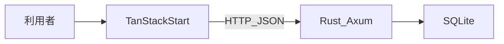

# レシピ管理アプリ

家庭や個人利用を想定した、レシピの登録・検索・参照・編集・削除を行う Web アプリケーションです。

ログインや画像アップロードは扱わず、レシピ本体と材料・手順の構造化、カテゴリによる分類、一覧の検索・フィルタを中心にします。詳細画面では人数を変えたときの材料量の按分表示ができます（保存はしません）。

実装前の設計資料は [`docs/`](docs/) にあります。

## ドキュメント

| 資料 | 内容 |
| --- | --- |
| [機能要件](docs/01-functional-requirements.md) | できること / 対象外 |
| [非機能要件](docs/02-non-functional-requirements.md) | 性能、可用性、セキュリティ、運用 |
| [ユースケース](docs/03-use-cases.md) | アクターと主要シナリオ |
| [画面遷移](docs/04-screen-transitions.md) | 画面一覧と遷移 |
| [データモデル](docs/05-data-model.md) | ER 図とテーブル定義 |
| [API 設計](docs/06-api.md) | REST 資源とリクエスト / レスポンス |
| [システム構成](docs/07-architecture.md) | 3 層構成、ローカル、OCI IaaS、Terraform |

## 技術スタック

| 層 | 採用 | 役割 |
| --- | --- | --- |
| フロントエンド | TypeScript / TanStack Start | 画面、ルーティング、入力チェック、API 呼び出し |
| バックエンド | Rust / Axum | REST API、バリデーション、トランザクション |
| データベース | SQLite | レシピ・材料・手順・カテゴリの永続化 |
| インフラ | Oracle Cloud Infrastructure（Compute） | IaaS 上での常駐プロセス |
| インフラ | Oracle Cloud Infrastructure（Compute） | IaaS 上での常駐プロセス |
| IaC | Terraform（HashiCorp OCI Provider） | VCN / Compute / NSG などの再現 |
| ローカル開発（任意） | Docker Compose | FE / API / SQLite をまとめて起動 |

開発時の既定ポートはフロントエンド `localhost:5173`、バックエンド `localhost:8080` です。ローカルでは [Docker Compose](docs/07-architecture.md#21-docker-compose開発のみ任意) で揃えてもよい（本番では使わない）。

## 技術選定の理由

### フロントエンド: TanStack Start

このアプリは画面と API を別プロセスに分けます。一覧の検索条件は URL のクエリに載せ、詳細・編集はパスパラメータでレシピを特定します。

TanStack Start は TanStack Router を土台にしており、パスパラメータ・search params・loader の戻り値が TypeScript でつながります。フィルタ条件の型ずれや、存在しない画面へのリンクをコンパイル時に検出できます。Next.js は React Server Components や Server Actions によるフルスタック寄りの設計が強く、独立した REST API との責務境界が曖昧になりやすいため、本構成には向きません。

本番は OCI Compute 上の **2 VM**（fe-vm + api-vm）として自己ホストします。fe-vm の nginx が `/api` を api-vm へプロキシします。

### バックエンド: Rust（Axum）

本番は Always Free 枠の小さな VM に API を常駐させます。Rust はメモリ使用量が小さく、ガベージコレクションによる停止がありません。長時間稼働する IaaS 上のプロセスとして、メモリ安全性も運用上の利点になります。

REST では入力不備とサーバー障害を HTTP ステータスで分ける必要があります。Rust の `Result` 型でバリデーション失敗（400）と予期しない失敗（500）を型として分けやすく、Axum は tokio 上の HTTP API と CORS・ログなどのミドルウェアを素直に組み合わせられます。

### データベース: SQLite

認証なしの単独利用を想定し、同時書き込みは限定的です。SQLite には書き込み時のファイルロックがありますが、本アプリの利用パターンでは許容できます。api-vm に API と DB を同居させ、ファイルベース運用とバックアップの簡素化を優先します。

テーブル定義と SQL は PostgreSQL へ移しやすい形に留め、接続先の差し替え余地を残します。

### インフラ: OCI IaaS と Terraform

PaaS へのデプロイは、仮想ネットワーク、セキュリティリスト、SSH、リバースプロキシ、プロセス管理といった層が見えません。本課題ではそれらの運用を学習対象とするため、Compute インスタンスへ載せる IaaS 構成にします。

AWS の無料枠は過去の受講で使い切っているため、期限のない Always Free Compute を提供する Oracle Cloud Infrastructure を使います。ネットワークと仮想マシンの作成は、公式プロバイダ `hashicorp/oci` が存在するため Terraform でコード化します。コンソール操作だけに頼らず、同じ構成を再現できるようにします。

詳細は [システム構成](docs/07-architecture.md) を参照してください。

## アプリケーション構成（概要）

- ブラウザがクライアント、Rust API がサーバー、SQLite がデータの保存先です。
- フロントエンドからデータベースへは直接アクセスしません。
- 開発時はオリジンが異なるため、API 側で CORS により `http://localhost:5173` を許可します。

## 現状

ドキュメント整備まで完了しています。アプリケーション本体の実装はこれから行います。
