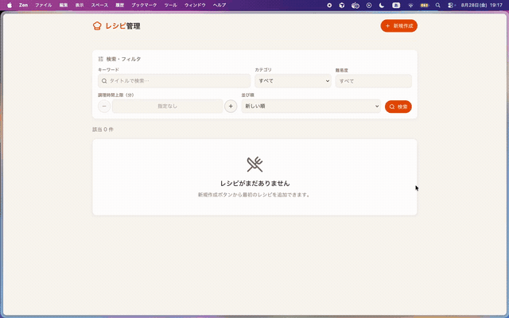
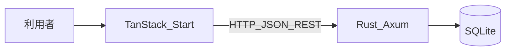
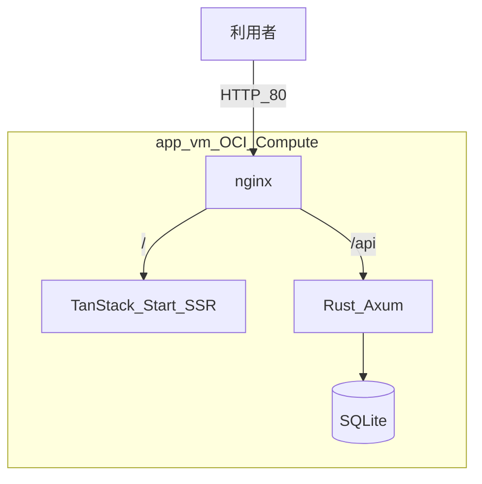
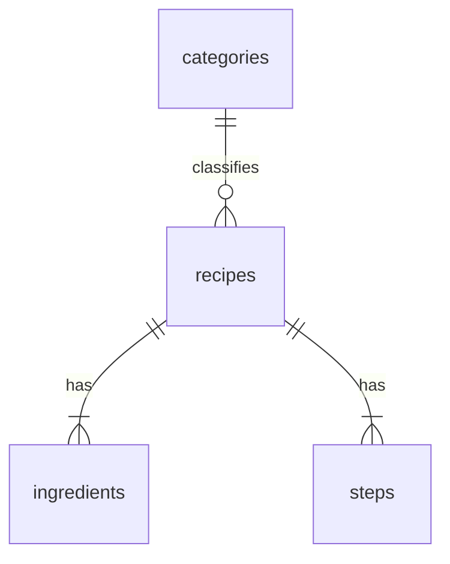

# レシピ管理アプリ

家庭や個人利用を想定した、レシピの登録・検索・参照・編集・削除を行う Web アプリケーションです。  
認証や画像アップロードは扱わず、**材料・手順の構造化**、**カテゴリ分類**、**一覧の検索・フィルタ**、**人数変更に応じた材料量の按分表示**を中心に実装しています。

**デモサイト:** [http://161.33.42.88/recipes](http://161.33.42.88/recipes)（OCI Always Free / `ap-osaka-1`）

## デモ

一覧・詳細・作成・編集・削除までを **1 本の画面録画** にまとめています（GIF は 2 倍速・約 1.5 分）。

<p align="center">
  
</p>

> GitHub README ではリポジトリ内 MP4 を `<video>` で埋め込んでも表示されないため、GIF を使っています。  
> 高画質版: [demo.mp4](docs/assets/demo.mp4)（約 1.1 MB / 約 3 分）

## 主な機能


| 機能      | 概要                                                  |
| ------- | --------------------------------------------------- |
| レシピ一覧   | カードグリッド表示。タイトル・カテゴリ・難易度・調理時間の要約                     |
| 検索・フィルタ | タイトル部分一致、カテゴリ・難易度・調理時間上限。並び替え（新着 / 調理時間昇順）          |
| レシピ詳細   | 材料・手順の表示。表示人数を変えると材料量を按分（保存はしない）                    |
| 新規作成    | 親情報と材料・手順を 1 リクエストで登録（トランザクション）                     |
| 編集      | 親は `PUT`、材料・手順は行単位 API（`POST` / `PATCH` / `DELETE`） |
| 削除      | 確認ダイアログのうえ物理削除（材料・手順も CASCADE）                      |


検索条件は URL の search params に同期するため、ブックマークや再読み込みで同じ絞り込みを復元できます。

## 技術スタック


| 層       | 採用                                      | 役割                                  |
| ------- | --------------------------------------- | ----------------------------------- |
| フロントエンド | TypeScript / TanStack Start             | 画面、ルーティング、入力チェック、API 呼び出し           |
| UI      | Tailwind CSS / shadcn/ui / Lucide React | Pattern A（ウォーム・カード型）のスタイルと共通コンポーネント |
| バックエンド  | Rust / Axum                             | REST API、バリデーション、トランザクション           |
| データベース  | SQLite                                  | レシピ・材料・手順・カテゴリの永続化                  |
| インフラ    | Oracle Cloud Infrastructure（Compute）    | Always Free 枠での本番ホスティング             |
| IaC     | Terraform（HashiCorp OCI Provider）       | VCN / Compute / NSG のコード化           |
| 本番プロセス  | nginx + systemd                         | リバースプロキシ、Node SSR、Rust API の常駐      |


開発時の既定ポート: フロントエンド `localhost:5173`、バックエンド `localhost:8080`

## 技術選定の理由


### フロントエンド: TanStack Start

画面と API を別プロセスに分ける構成です。一覧の検索条件は URL クエリ、詳細・編集はパスパラメータでレシピを特定します。

TanStack Start（TanStack Router ベース）は、search params・loader の戻り値が TypeScript でつながるため、フィルタ条件の型ずれや存在しないルートへのリンクをコンパイル時に検出できます。Next.js の Server Components / Server Actions 中心の設計は、独立 REST API との責務境界が曖昧になりやすく、本構成には向きません。

### バックエンド: Rust（Axum）

Always Free の小さな VM に API を常駐させます。Rust はメモリ使用量が小さく GC 停止がなく、IaaS 上の長時間稼働に適しています。`Result` 型でバリデーション失敗（400）と予期しない失敗（500）を分けやすく、Axum は CORS・ログなどのミドルウェアも素直に組み合わせられます。

### データベース: SQLite

認証なしの単独利用を想定し、同時書き込みは限定的です。API と DB を同一 VM に同居させ、ファイルベース運用とバックアップを簡素化します。スキーマと SQL は PostgreSQL へ移しやすい形に留めています。

### インフラ: OCI IaaS + Terraform

PaaS では VCN・セキュリティリスト・SSH・リバースプロキシ・プロセス管理が見えにくいため、Compute 上に自己ホストして IaaS の運用を学習対象にしました。AWS 無料枠を使い切っているため、期限のない Always Free Compute がある Oracle Cloud Infrastructure を採用し、`hashicorp/oci` でネットワークと VM をコード化しています。

## システム構成


### アプリケーション（3 層）


```mermaid
flowchart LR
  User[利用者] --> FE[TanStack_Start]
  FE -->|HTTP_JSON_REST| API[Rust_Axum]
  API --> DB[(SQLite)]
```


- ブラウザ → フロントエンド → Rust API → SQLite。フロントから DB へは直接アクセスしません。
- 開発時はオリジンが異なるため、API 側で CORS により `http://localhost:5173` を許可します。


### 本番（OCI Always Free）

**公開 URL:** [http://161.33.42.88/recipes](http://161.33.42.88/recipes)

初級環境は **1 台の app-vm**（nginx + Node SSR + Rust API + SQLite）構成です。API の 8080 は localhost のみ公開し、利用者は nginx 経由で `/` と `/api` にアクセスします。


```mermaid
flowchart TB
  User[利用者] -->|HTTP_80| Nginx[nginx]
  Nginx -->|"/"| FE[TanStack_Start_SSR]
  Nginx -->|"/api"| API[Rust_Axum]
  API --> DB[(SQLite)]
  subgraph app_vm [app_vm_OCI_Compute]
    Nginx
    FE
    API
    DB
  end
```


Terraform で VCN / サブネット / NSG / Compute を作成し、`infra/deploy/deploy.sh` でビルド成果物を SSH 配置します。詳細は [システム構成](docs/07-architecture.md) と [Terraform 初級環境](infra/terraform/environments/beginner/README.md) を参照してください。

## API 概要


| 項目          | 内容                        |
| ----------- | ------------------------- |
| ベース URL（開発） | `http://localhost:8080`   |
| 形式          | JSON（UTF-8）               |
| 認証          | なし                        |
| スタイル        | REST（資源は名詞、操作は HTTP メソッド） |


### エンドポイント一覧


| メソッド   | パス                                              | 説明                     |
| ------ | ----------------------------------------------- | ---------------------- |
| GET    | `/api/categories`                               | カテゴリ一覧                 |
| GET    | `/api/recipes`                                  | レシピ一覧（検索・フィルタ）         |
| GET    | `/api/recipes/{id}`                             | レシピ詳細（材料・手順込み）         |
| POST   | `/api/recipes`                                  | レシピ作成（親・材料・手順をネストして一括） |
| PUT    | `/api/recipes/{id}`                             | レシピ更新（親情報のみ）           |
| POST   | `/api/recipes/{id}/ingredients`                 | 材料 1 行追加               |
| PATCH  | `/api/recipes/{id}/ingredients/{ingredient_id}` | 材料 1 行更新               |
| DELETE | `/api/recipes/{id}/ingredients/{ingredient_id}` | 材料 1 行削除               |
| POST   | `/api/recipes/{id}/steps`                       | 手順 1 行追加               |
| PATCH  | `/api/recipes/{id}/steps/{step_id}`             | 手順 1 行更新               |
| DELETE | `/api/recipes/{id}/steps/{step_id}`             | 手順 1 行削除               |
| DELETE | `/api/recipes/{id}`                             | レシピ物理削除                |


**設計上のポイント**

- **作成**: 親・材料・手順を `POST /api/recipes` にネストして 1 トランザクションで登録
- **更新**: 親は `PUT`。材料・手順は行単位 API。編集時に子行を全 DELETE + INSERT しない（1 行だけ直す UX に合わせる）
- **一覧クエリ**: `q`（タイトル部分一致）、`category_id`、`difficulty`（1〜5）、`max_cook_time`（10 分単位）、`sort`（`newest` / `cook_time_asc`）
- **人数按分**: API の責務外。詳細画面のフロントが `servings` と `ingredients[].quantity` から算出


### エラーレスポンス（共通）

```json
{
  "error": {
    "code": "VALIDATION_ERROR",
    "message": "入力内容に誤りがあります",
    "details": [
      { "field": "title", "message": "タイトルは必須です" }
    ]
  }
}
```


| HTTP | 用途             |
| ---- | -------------- |
| 200  | 取得成功・更新成功・削除成功 |
| 201  | 作成成功           |
| 400  | バリデーションエラー     |
| 404  | リソース不存在        |
| 500  | サーバー内部エラー      |


リクエスト / レスポンスの詳細・バリデーションルールは [API 設計](docs/06-api.md) を参照してください。

## データモデル（概要）


| テーブル          | 役割                               |
| ------------- | -------------------------------- |
| `categories`  | カテゴリマスタ（シード 5 件。利用者 CRUD なし）     |
| `recipes`     | レシピ本体（タイトル、説明、人数、調理時間、難易度 1〜5 等） |
| `ingredients` | 材料行（名前、分量、単位、並び順）                |
| `steps`       | 手順行（番号、本文）                       |



```mermaid
erDiagram
  categories ||--o{ recipes : classifies
  recipes ||--|{ ingredients : has
  recipes ||--|{ steps : has
```


ER 図・制約・シードデータの詳細は [データモデル](docs/05-data-model.md) を参照してください。

## 画面構成


| 画面    | パス                  | 主な操作               |
| ----- | ------------------- | ------------------ |
| レシピ一覧 | `/recipes`          | 検索・フィルタ、新規作成、詳細、削除 |
| レシピ詳細 | `/recipes/$id`      | 詳細表示、人数按分、編集、削除    |
| 新規作成  | `/recipes/new`      | 入力・保存              |
| 編集    | `/recipes/$id/edit` | 親・材料・手順の編集、フッター保存  |


UI は **Pattern A（ウォーム・カード型）**。Tailwind CSS + shadcn/ui + Lucide アイコン。詳細は [UI デザイン](docs/08-ui-design.md) / [画面遷移](docs/04-screen-transitions.md)。

## ローカル開発


### 前提

- Node.js 22+ / pnpm
- Rust（stable）
- SQLite（sqlx マイグレーションで自動作成）


### 起動

```bash
# バックエンド（:8080）
cd backend
cargo run

# フロントエンド（:5173）— 別ターミナル
cd frontend
pnpm install
pnpm dev
```

ブラウザで `http://localhost:5173/recipes` を開きます。

### テスト

```bash
cd backend && cargo test
cd frontend && pnpm test
```

TDD（RED → GREEN → REFACTOR）と垂直スライス（ユースケース単位で API + 画面 + テストを完結）で実装しています。方針の詳細は [開発ガイド](docs/09-development-guide.md)。

## リポジトリ構成

```
recipe-app/
├── frontend/          # TanStack Start + Tailwind + shadcn/ui
├── backend/           # Rust / Axum + sqlx
├── docs/              # 設計ドキュメント・デモ動画
├── infra/
│   ├── terraform/     # OCI インフラ（beginner 環境）
│   └── deploy/        # ビルド・SSH デプロイスクリプト
└── README.md
```


## 設計ドキュメント

実装前後の設計資料は `[docs/](docs/)` にあります。README では概要のみ記載し、詳細仕様は各ドキュメントを参照してください。


| 資料                                              | 内容                             |
| ----------------------------------------------- | ------------------------------ |
| [機能要件](docs/01-functional-requirements.md)      | できること / 対象外                    |
| [非機能要件](docs/02-non-functional-requirements.md) | 性能、可用性、セキュリティ、運用               |
| [ユースケース](docs/03-use-cases.md)                  | アクターと主要シナリオ                    |
| [画面遷移](docs/04-screen-transitions.md)           | 画面一覧と遷移                        |
| [データモデル](docs/05-data-model.md)                 | ER 図とテーブル定義                    |
| [API 設計](docs/06-api.md)                        | REST 資源とリクエスト / レスポンス          |
| [システム構成](docs/07-architecture.md)               | 3 層構成、ローカル、OCI、Terraform       |
| [UI デザイン](docs/08-ui-design.md)                 | Pattern A、Tailwind / shadcn/ui |
| [開発ガイド](docs/09-development-guide.md)           | TDD 方針、テスト戦略、垂直スライス            |


## 実装状況

垂直スライス（VS-00 〜 VS-07）を完了しています。


| スライス  | 内容                        |
| ----- | ------------------------- |
| VS-00 | 基盤（Walking Skeleton）      |
| VS-01 | 一覧・検索・フィルタ                |
| VS-02 | 詳細・人数按分                   |
| VS-03 | 新規作成                      |
| VS-04 | 編集（行単位 API）               |
| VS-05 | 削除                        |
| VS-06 | Docker Compose（開発用・任意）    |
| VS-07 | Terraform 初級環境 + OCI デプロイ |


Issue 一覧: [垂直スライス実装ロードマップ #29](https://github.com/rikuto-web/recipe-app/issues/29)