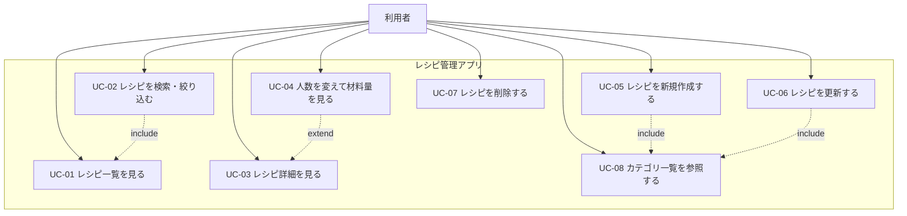

# ユースケース

## 1. アクター

| アクター | 説明 |
| --- | --- |
| 利用者 | ブラウザからアプリにアクセスし、レシピを閲覧・登録・更新・削除する。認証は行わない |

## 2. ユースケース一覧

| ID | ユースケース名 | 概要 |
| --- | --- | --- |
| UC-01 | レシピ一覧を見る | 登録済みレシピを一覧表示する |
| UC-02 | レシピを検索・絞り込む | タイトル検索、カテゴリ・難易度・調理時間で絞り込み、並び替える |
| UC-03 | レシピ詳細を見る | 材料・手順を含むレシピを表示する |
| UC-04 | 人数を変えて材料量を見る | 詳細画面で表示人数を変更し、材料量を按分表示する |
| UC-05 | レシピを新規作成する | 親情報・材料・手順をまとめて登録する |
| UC-06 | レシピを更新する | 親・材料を更新し、手順は行単位で修正する |
| UC-07 | レシピを削除する | 確認後、レシピと関連データを物理削除する |
| UC-08 | カテゴリ一覧を参照する | 作成・フィルタ用のカテゴリを取得する |

## 3. ユースケース図

- UC-02 は UC-01 の一覧画面で実行される（`include`）。
- UC-04 は UC-03 の詳細画面での追加操作（`extend`）。
- UC-05 / UC-06 はカテゴリ選択のために UC-08 を利用する（`include`）。

## 4. 主要シナリオ

### UC-02: レシピを検索・絞り込む

**前提**: 1 件以上のレシピが登録されている。

**基本フロー**

1. 利用者が一覧画面 `/recipes` を開く。
2. システムが `GET /api/recipes` で一覧を取得し、表示する。
3. 利用者がキーワード、カテゴリ、難易度、調理時間上限、並び順を指定する。
4. システムが条件を URL の search params に反映する。
5. システムが条件付きで `GET /api/recipes` を再取得し、一覧を更新する。

**代替フロー**

- 3a. 条件に一致するレシピがない場合、空状態メッセージを表示する。

### UC-05: レシピを新規作成する

**前提**: カテゴリがシード済みである。

**基本フロー**

1. 利用者が一覧から「新規作成」を選び、`/recipes/new` を開く。
2. システムが `GET /api/categories` でカテゴリを取得する。
3. 利用者がタイトル、説明、カテゴリ、人数、調理時間、難易度、材料行、手順行を入力する。
4. 利用者が保存を押す。
5. フロントエンドが入力チェックを行う。
6. システムが `POST /api/recipes` で親と子をまとめて送信する。
7. バックエンドがバリデーション後、1 トランザクションで保存する。
8. システムが詳細画面 `/recipes/{id}` へ遷移する。

**代替フロー**

- 5a. フロントの入力チェックでエラーがある場合、送信せずフィールド横にエラーを表示する。
- 7a. バックエンドのバリデーションで 400 が返った場合、エラー内容を画面に表示する。
- 7b. サーバー障害で 5xx が返った場合、再試行を促すメッセージを表示する。

### UC-06: レシピを更新する

**前提**: 対象レシピが存在する。

**基本フロー**

1. 利用者が詳細画面から「編集」を選び、`/recipes/{id}/edit` を開く。
2. システムが `GET /api/recipes/{id}` と `GET /api/categories` を取得する。
3. 利用者が親情報、材料、手順を修正する。
4. 親情報を保存する場合、フロントエンドが入力チェック後 `PUT /api/recipes/{id}` を送る。
5. 材料・手順を 1 行だけ直す場合、当該行の保存で `PATCH` を呼ぶ。
6. 行追加・削除は `POST` / `DELETE` を呼ぶ。

**代替フロー**

- 2a. レシピが存在しない場合、404 を受け取り一覧へ誘導する。
- 4a / 5a. 更新失敗時は編集画面に留まり、エラーを表示する。
- 7a. キャンセル時は詳細画面 `/recipes/{id}` へ戻る。未保存の親情報がある場合は確認ダイアログを出す。

### UC-07: レシピを削除する

**基本フロー**

1. 利用者が詳細画面（または一覧）で「削除」を選ぶ。
2. システムが確認ダイアログを表示する。
3. 利用者が削除を確定する。
4. システムが `DELETE /api/recipes/{id}` を呼び出し、物理削除する。
5. 成功後、一覧画面へ遷移する。

**代替フロー**

- 3a. 利用者がキャンセルした場合、操作を中断する。
- 4a. 404 の場合、すでに削除済みとして一覧へ戻す。

### UC-04: 人数を変えて材料量を見る

**前提**: 詳細画面でレシピを表示している。

**基本フロー**

1. 利用者が表示人数を変更する。
2. システムが基準人数（保存済み `servings`）に対する比率を計算する。
3. 各材料の分量を `元の分量 × 表示人数 / 基準人数` で表示する。

**補足**

- API は呼ばない。按分結果は保存しない。
