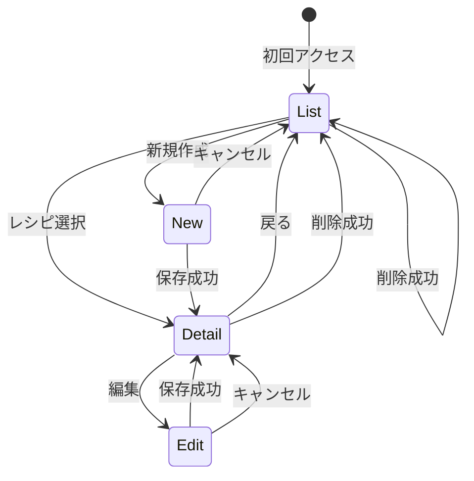

# 画面遷移

## 1. 画面一覧

| ID | 画面名 | パス | 主な操作 |
| --- | --- | --- | --- |
| SC-01 | レシピ一覧 | `/recipes` | 一覧表示、検索・フィルタ、新規作成、詳細へ、削除 |
| SC-02 | レシピ詳細 | `/recipes/$id` | 詳細表示、人数按分、編集へ、削除、一覧へ |
| SC-03 | レシピ新規作成 | `/recipes/new` | 入力、材料・手順の行追加/削除、保存、キャンセル時は一覧へ |
| SC-04 | レシピ編集 | `/recipes/$id/edit` | 親の編集、材料・手順の行単位保存、キャンセル時は詳細へ |

削除専用画面は作らない。確認ダイアログで完結する。

## 2. 画面遷移図



## 3. ルーティングと search params

TanStack Router でパスとクエリを型安全に扱う。

| 画面 | パス | search params（例） |
| --- | --- | --- |
| 一覧 | `/recipes` | `q`, `category_id`, `difficulty`, `max_cook_time`, `sort` |
| 詳細 | `/recipes/$id` | なし（人数按分は画面内 state） |
| 新規 | `/recipes/new` | なし |
| 編集 | `/recipes/$id/edit` | なし |

一覧のフィルタ条件は URL に載せ、ブックマークや再読み込みで同じ条件を復元できるようにする。

## 4. 画面別ワイヤーフレーム（要素）

### SC-01 レシピ一覧

```
+--------------------------------------------------+
| レシピ管理                              [新規作成] |
+--------------------------------------------------+
| キーワード [________]  カテゴリ [v]  難易度 [v]    |
| 調理時間上限 [__]分   並び [新しい順 v]  [検索]   |
+--------------------------------------------------+
| タイトル        | カテゴリ | 時間 | 難易度   | 操作 |
| 醤油ラーメン    | 和食     | 30分 | ★★★☆☆ | ...  |
| チーズケーキ    | デザート | 60分 | ★★★★☆ | ...  |
+--------------------------------------------------+
| 該当 2 件                                        |
+--------------------------------------------------+
```

- 操作: 詳細へ、削除（確認ダイアログ）
- 0 件時: 「レシピがありません」「条件を変えて検索してください」等

### SC-02 レシピ詳細

```
+--------------------------------------------------+
| [< 一覧]                    [編集] [削除]        |
+--------------------------------------------------+
| 醤油ラーメン                                     |
| 和食 / 30分 / ★★★☆☆ / 2人分                       |
| 説明文...                                        |
+--------------------------------------------------+
| 表示人数 [ 4 ] 人  （基準: 2人分）               |
| 材料                                             |
|   中華麺    240 g                                |
|   豚バラ    160 g                                |
|   ...                                            |
| 手順                                             |
|   1. スープを作る                                |
|   2. 麺を茹でる                                  |
+--------------------------------------------------+
```

### SC-03 / SC-04 新規作成・編集

共通フォーム。編集は既存値を loader で取得して初期表示する。

**キャンセル時の遷移**

| 画面 | 遷移先 | 理由 |
| --- | --- | --- |
| 新規作成（SC-03） | 一覧 `/recipes` | まだレシピが存在しないため |
| 編集（SC-04） | 詳細 `/recipes/$id` | 編集前に見ていたレシピへ戻る |

未保存の変更がある場合は確認ダイアログを出してから遷移する。

```
+--------------------------------------------------+
| レシピを作成 / 編集                              |
+--------------------------------------------------+
| タイトル * [________________]                    |
| カテゴリ * [和食 v]                              |
| 人数 * [2]  調理時間 * [30] 分  難易度 * [★★★☆☆]     |
| 説明   [________________________]                |
+--------------------------------------------------+
| 材料 *                          [+ 行を追加]     |
|   名前 [____] 分量 [__] 単位 [g v / 自由入力] [保存] [削除] |
+--------------------------------------------------+
| 手順 *                          [+ 行を追加]     |
|   1. [________________________] [保存] [削除]      |
|   2. [________________________] [保存] [削除]      |
+--------------------------------------------------+
| [キャンセル]                    [親情報を保存]     |
+--------------------------------------------------+
```

- 材料・手順行は **行ごとに保存** できる（`PATCH`）。親情報の保存ボタンとは独立。
- **新規作成（SC-03）** は材料・手順も含めて一括保存。キャンセルは一覧へ。
- **編集（SC-04）** は材料・手順をピンポイント更新可能。親情報は `PUT`、子行は `PATCH`。キャンセルは詳細へ。

## 5. エラー・空状態

| 状況 | 画面 | 振る舞い |
| --- | --- | --- |
| 一覧 0 件 | 一覧 | 空状態 UI |
| 存在しない ID | 詳細 / 編集 | 404 メッセージ → 一覧へ |
| API 失敗 | 全般 | トーストまたはインラインエラー |
| バリデーションエラー | 新規 / 編集 | フィールド横にエラー表示 |

## 6. ユースケースとの対応

| ユースケース | 画面 |
| --- | --- |
| UC-01, UC-02 | SC-01 |
| UC-03, UC-04, UC-07 | SC-02（UC-07 は SC-01 からも可） |
| UC-05 | SC-03 |
| UC-06 | SC-04 |
| UC-08 | SC-03, SC-04, SC-01（フィルタ） |
