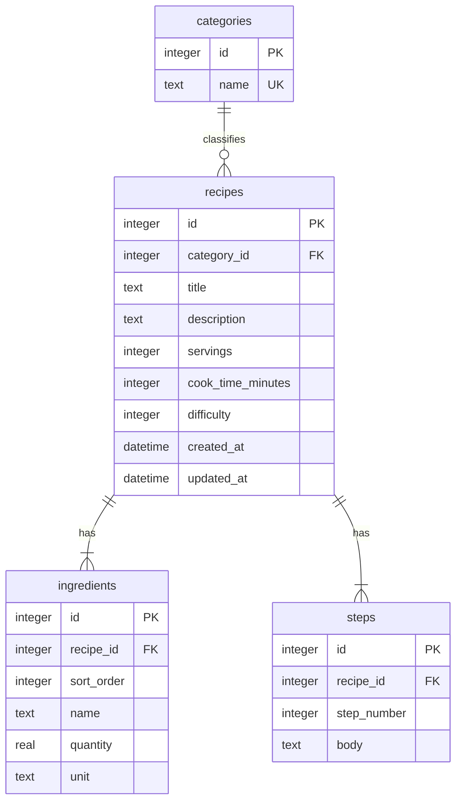

# データモデル

## 1. 概要

リレーショナルデータベース（SQLite）で、レシピを親テーブル、材料・手順を子テーブルとして正規化する。カテゴリはマスタテーブルとし、利用者による CRUD は行わない。

## 2. ER 図



### 関係の読み方

| 関係 | 意味 |
| --- | --- |
| `categories \|\|--o{ recipes` | カテゴリ 1 件にレシピ 0 件以上。レシピ 1 件は必ずカテゴリ 1 件に属する |
| `recipes \|\|--\|{ ingredients` | レシピ 1 件に材料 1 件以上。材料 1 行は必ずレシピ 1 件に属する |
| `recipes \|\|--\|{ steps` | レシピ 1 件に手順 1 件以上。手順 1 行は必ずレシピ 1 件に属する |

「材料が複数」は、1 レシピの材料リスト（麺、肉、醤油…）が複数行ある、という意味である。材料の「パターン」が複数あるわけではない。

## 3. テーブル定義

### 3.1 categories

| カラム | 型 | 制約 | 説明 |
| --- | --- | --- | --- |
| id | INTEGER | PK, AUTOINCREMENT | カテゴリ ID |
| name | TEXT | NOT NULL, UNIQUE | 表示名 |

**シードデータ（例）**

| id | name |
| --- | --- |
| 1 | 和食 |
| 2 | 洋食 |
| 3 | 中華 |
| 4 | デザート |
| 5 | その他 |

### 3.2 recipes

| カラム | 型 | 制約 | 説明 |
| --- | --- | --- | --- |
| id | INTEGER | PK, AUTOINCREMENT | レシピ ID |
| category_id | INTEGER | NOT NULL, FK → categories(id) | カテゴリ |
| title | TEXT | NOT NULL | タイトル（1〜100 文字） |
| description | TEXT | NOT NULL DEFAULT '' | 説明 |
| servings | INTEGER | NOT NULL, CHECK (servings >= 1) | 基準人数 |
| cook_time_minutes | INTEGER | NOT NULL, CHECK (cook_time_minutes >= 0) | 調理時間（分） |
| difficulty | INTEGER | NOT NULL, CHECK (difficulty BETWEEN 1 AND 5) | 難易度（1=★1 … 5=★5） |
| created_at | TEXT | NOT NULL | ISO 8601（UTC） |
| updated_at | TEXT | NOT NULL | ISO 8601（UTC） |

**インデックス（例）**

- `idx_recipes_category_id` ON `category_id`
- `idx_recipes_created_at` ON `created_at DESC`（新しい順一覧用）

### 3.3 ingredients

| カラム | 型 | 制約 | 説明 |
| --- | --- | --- | --- |
| id | INTEGER | PK, AUTOINCREMENT | 材料行 ID |
| recipe_id | INTEGER | NOT NULL, FK → recipes(id) ON DELETE CASCADE | 親レシピ |
| sort_order | INTEGER | NOT NULL | 表示順（1 始まり） |
| name | TEXT | NOT NULL | 材料名 |
| quantity | REAL | NOT NULL, CHECK (quantity > 0) | 分量（基準人数時） |
| unit | TEXT | NOT NULL | 単位（自由文字列。UI では常用単位を選択肢提示） |

**インデックス（例）**

- `idx_ingredients_recipe_id` ON `recipe_id`

### 3.4 steps

| カラム | 型 | 制約 | 説明 |
| --- | --- | --- | --- |
| id | INTEGER | PK, AUTOINCREMENT | 手順行 ID |
| recipe_id | INTEGER | NOT NULL, FK → recipes(id) ON DELETE CASCADE | 親レシピ |
| step_number | INTEGER | NOT NULL | 手順番号（1 始まり） |
| body | TEXT | NOT NULL | 手順本文 |

**制約**

- `(recipe_id, step_number)` に UNIQUE を張り、同一レシピ内で手順番号が重複しないようにする

## 4. DDL（参考）

```sql
CREATE TABLE categories (
  id INTEGER PRIMARY KEY AUTOINCREMENT,
  name TEXT NOT NULL UNIQUE
);

CREATE TABLE recipes (
  id INTEGER PRIMARY KEY AUTOINCREMENT,
  category_id INTEGER NOT NULL REFERENCES categories(id),
  title TEXT NOT NULL,
  description TEXT NOT NULL DEFAULT '',
  servings INTEGER NOT NULL CHECK (servings >= 1),
  cook_time_minutes INTEGER NOT NULL CHECK (cook_time_minutes >= 0),
  difficulty INTEGER NOT NULL CHECK (difficulty BETWEEN 1 AND 5),
  created_at TEXT NOT NULL,
  updated_at TEXT NOT NULL
);

CREATE TABLE ingredients (
  id INTEGER PRIMARY KEY AUTOINCREMENT,
  recipe_id INTEGER NOT NULL REFERENCES recipes(id) ON DELETE CASCADE,
  sort_order INTEGER NOT NULL,
  name TEXT NOT NULL,
  quantity REAL NOT NULL CHECK (quantity > 0),
  unit TEXT NOT NULL
);

CREATE TABLE steps (
  id INTEGER PRIMARY KEY AUTOINCREMENT,
  recipe_id INTEGER NOT NULL REFERENCES recipes(id) ON DELETE CASCADE,
  step_number INTEGER NOT NULL,
  body TEXT NOT NULL,
  UNIQUE (recipe_id, step_number)
);

CREATE INDEX idx_recipes_category_id ON recipes(category_id);
CREATE INDEX idx_recipes_created_at ON recipes(created_at DESC);
CREATE INDEX idx_ingredients_recipe_id ON ingredients(recipe_id);
```

## 5. トランザクション方針

### 作成（POST）

1. `recipes` に INSERT
2. `ingredients` に複数 INSERT
3. `steps` に複数 INSERT

いずれか失敗時は ROLLBACK し、親も子も残さない。

### 更新（PUT：親のみ）

1. `recipes` を UPDATE（タイトル、説明、カテゴリ、人数、調理時間、難易度）

材料・手順は PUT に含めない。変更は行単位 API で行う。

### 材料の行単位操作

| 操作 | 内容 |
| --- | --- |
| 追加 | `ingredients` に INSERT |
| 更新 | 対象行の `name` / `quantity` / `unit` / `sort_order` を UPDATE（`PATCH`） |
| 削除 | 対象行を DELETE |

各操作は 1 トランザクションとする。削除後 0 件は不可（最低 1 材料必須）。

### 手順の行単位操作

| 操作 | 内容 |
| --- | --- |
| 追加 | `steps` に INSERT。必要なら既存手順の `step_number` を再採番 |
| 更新 | 対象行の `body` または `step_number` を UPDATE |
| 削除 | 対象行を DELETE。残りの `step_number` を詰める |

各操作は 1 トランザクションとする。

### 削除（DELETE）

`recipes` を **物理 DELETE** し、`ON DELETE CASCADE` で子を DB から削除する。論理削除は行わない。

## 6. SQLite 選定とロック

認証なしの単独利用を想定し、同時書き込みは限定的である。SQLite には書き込み時のファイルロックがあるが、本アプリの利用パターン（個人がたまに保存する）では許容できる。api-vm 上に API と DB を同居させ、FE とは VM で分離する。

## 7. 将来拡張（参考）

| 拡張 | 変更イメージ |
| --- | --- |
| ユーザー | `users` テーブル追加、`recipes.user_id` |
| 画像 | オブジェクトストレージ + `recipes.image_url` |
| PostgreSQL 移行 | 接続先変更、型・CHECK の方言調整 |
| 材料マスタ | `ingredient_master` と中間テーブル |
