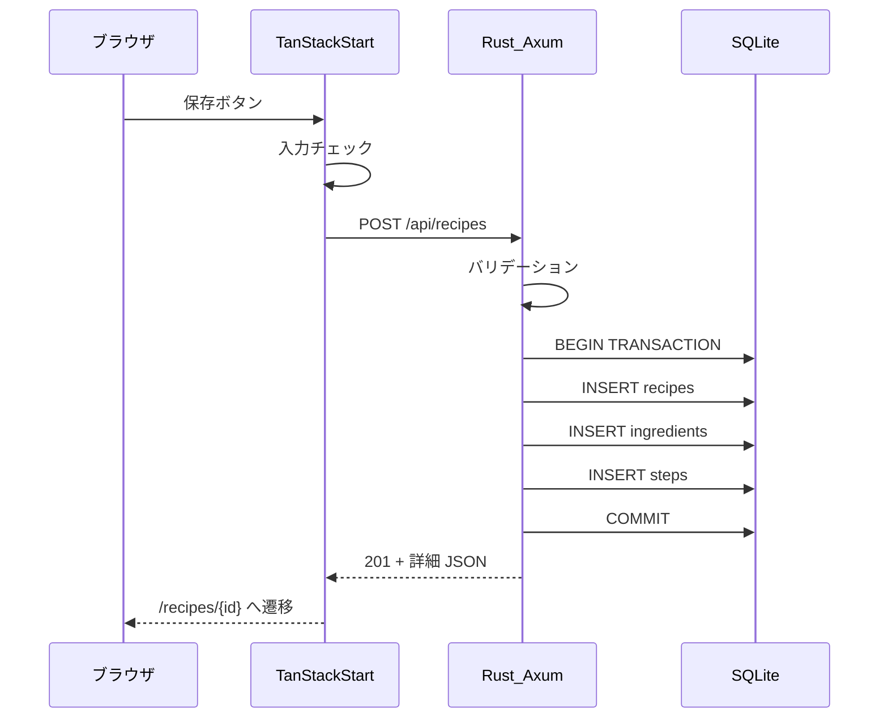
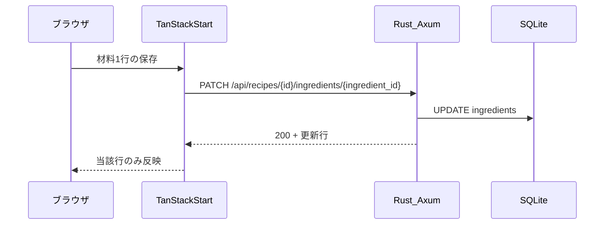
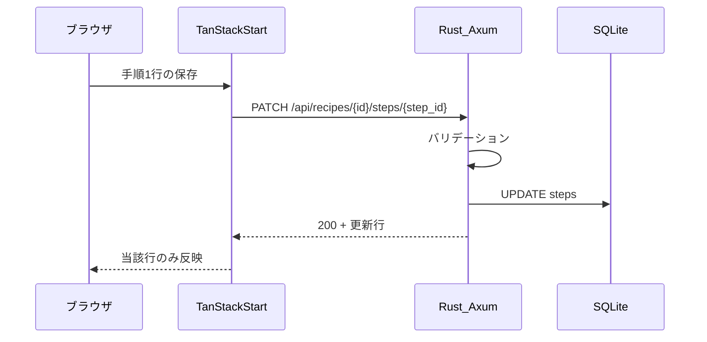

# API 設計

## 1. 概要

| 項目 | 内容 |
| --- | --- |
| ベース URL（開発） | `http://localhost:8080` |
| 形式 | JSON（UTF-8） |
| 認証 | なし |
| スタイル | REST。資源は名詞、操作は HTTP メソッド |

フロントエンド（`:5173`）からのアクセスには CORS で開発オリジンを許可する。

## 2. エンドポイント一覧

| メソッド | パス | 説明 | ユースケース |
| --- | --- | --- | --- |
| GET | `/api/categories` | カテゴリ一覧 | UC-08 |
| GET | `/api/recipes` | レシピ一覧（検索・フィルタ） | UC-01, UC-02 |
| GET | `/api/recipes/{id}` | レシピ詳細（材料・手順込み） | UC-03 |
| POST | `/api/recipes` | レシピ作成 | UC-05 |
| PUT | `/api/recipes/{id}` | レシピ更新（親情報のみ） | UC-06 |
| POST | `/api/recipes/{id}/ingredients` | 材料 1 行追加 | UC-06 |
| PATCH | `/api/recipes/{id}/ingredients/{ingredient_id}` | 材料 1 行更新 | UC-06 |
| DELETE | `/api/recipes/{id}/ingredients/{ingredient_id}` | 材料 1 行削除 | UC-06 |
| POST | `/api/recipes/{id}/steps` | 手順 1 行追加 | UC-06 |
| PATCH | `/api/recipes/{id}/steps/{step_id}` | 手順 1 行更新 | UC-06 |
| DELETE | `/api/recipes/{id}/steps/{step_id}` | 手順 1 行削除 | UC-06 |
| DELETE | `/api/recipes/{id}` | レシピ物理削除 | UC-07 |

- **作成時**: 親・材料・手順を `POST /api/recipes` にネストして一括送信する。
- **更新時**: 親は `PUT /api/recipes/{id}`。材料・手順は行単位 API（`POST` / `PATCH` / `DELETE`）で追加・修正・削除する。
- **DELETE + INSERT は使わない**: 編集時に子行を全削除して再 INSERT する方式は採用しない。1 行だけ変えたい操作に合わせ、`PATCH` で部分更新する。

## 3. 共通

### 3.1 HTTP ステータス

| コード | 用途 |
| --- | --- |
| 200 | 取得成功、更新成功、削除成功 |
| 201 | 作成成功 |
| 400 | バリデーションエラー |
| 404 | リソース不存在 |
| 500 | サーバー内部エラー |

### 3.2 エラーレスポンス

```json
{
  "error": {
    "code": "VALIDATION_ERROR",
    "message": "入力内容に誤りがあります",
    "details": [
      { "field": "title", "message": "タイトルは必須です" }
    ]
  }
}
```

## 4. GET /api/categories

**レスポンス 200**

```json
{
  "categories": [
    { "id": 1, "name": "和食" },
    { "id": 2, "name": "洋食" }
  ]
}
```

## 5. GET /api/recipes

### クエリパラメータ

| 名前 | 型 | 必須 | 説明 |
| --- | --- | --- | --- |
| q | string | 否 | タイトル部分一致 |
| category_id | integer | 否 | カテゴリ ID |
| difficulty | integer | 否 | 1〜5（星の数） |
| max_cook_time | integer | 否 | 調理時間上限（分）。10 分単位（最小 10）に正規化して解釈する |
| sort | string | 否 | `newest`（既定）, `cook_time_asc` |

### レスポンス 200

一覧用の要約フィールドのみ返す（材料・手順は含めない）。

```json
{
  "recipes": [
    {
      "id": 1,
      "title": "醤油ラーメン",
      "category": { "id": 1, "name": "和食" },
      "servings": 2,
      "cook_time_minutes": 30,
      "difficulty": 3,
      "created_at": "2026-08-21T00:00:00Z",
      "updated_at": "2026-08-21T00:00:00Z"
    }
  ],
  "total": 1
}
```

## 6. GET /api/recipes/{id}

### レスポンス 200

```json
{
  "id": 1,
  "title": "醤油ラーメン",
  "description": "シンプルな醤油ラーメン",
  "category": { "id": 1, "name": "和食" },
  "servings": 2,
  "cook_time_minutes": 30,
  "difficulty": 3,
  "ingredients": [
    { "id": 10, "sort_order": 1, "name": "中華麺", "quantity": 120, "unit": "g" },
    { "id": 11, "sort_order": 2, "name": "豚バラ", "quantity": 80, "unit": "g" }
  ],
  "steps": [
    { "id": 20, "step_number": 1, "body": "スープを作る" },
    { "id": 21, "step_number": 2, "body": "麺を茹でる" }
  ],
  "created_at": "2026-08-21T00:00:00Z",
  "updated_at": "2026-08-21T00:00:00Z"
}
```

### レスポンス 404

存在しない ID の場合。

## 7. POST /api/recipes

### リクエスト

`id` は送らない。`ingredients` / `steps` は 1 件以上必須。

```json
{
  "title": "醤油ラーメン",
  "description": "シンプルな醤油ラーメン",
  "category_id": 1,
  "servings": 2,
  "cook_time_minutes": 30,
  "difficulty": 3,
  "ingredients": [
    { "sort_order": 1, "name": "中華麺", "quantity": 120, "unit": "g" },
    { "sort_order": 2, "name": "豚バラ", "quantity": 80, "unit": "g" }
  ],
  "steps": [
    { "step_number": 1, "body": "スープを作る" },
    { "step_number": 2, "body": "麺を茹でる" }
  ]
}
```

### レスポンス 201

`GET /api/recipes/{id}` と同型の詳細オブジェクト。`Location: /api/recipes/{id}` ヘッダを付けてもよい。

### レスポンス 400

必須欠落、件数 0、不正な `category_id` / `difficulty`（1〜5 以外）、`cook_time_minutes` が 10 未満または 10 分単位でない等。`§3.2` の `VALIDATION_ERROR` 形式。ネストフィールドは `ingredients[0].quantity` 形式。

```json
{
  "error": {
    "code": "VALIDATION_ERROR",
    "message": "入力内容に誤りがあります",
    "details": [
      { "field": "steps[0].body", "message": "手順本文は必須です" }
    ]
  }
}
```

## 8. PUT /api/recipes/{id}

### リクエスト

親情報のみ。材料・手順は含めない。

```json
{
  "title": "醤油ラーメン",
  "description": "シンプルな醤油ラーメン",
  "category_id": 1,
  "servings": 2,
  "cook_time_minutes": 30,
  "difficulty": 3
}
```

### レスポンス 200

更新後の詳細オブジェクト（材料・手順込み）。

### レスポンス 404

対象レシピが存在しない場合。

## 9. 材料の行単位 API

### POST /api/recipes/{id}/ingredients

**リクエスト**

```json
{
  "name": "ネギ",
  "quantity": 10,
  "unit": "g",
  "sort_order": 3
}
```

**レスポンス 201** … 追加した材料 1 行

### PATCH /api/recipes/{id}/ingredients/{ingredient_id}

**リクエスト**（指定したフィールドのみ更新）

```json
{
  "quantity": 15
}
```

**レスポンス 200** … 更新後の材料 1 行

### DELETE /api/recipes/{id}/ingredients/{ingredient_id}

**制約**: 削除後に材料が 0 件になる場合は 400（最低 1 材料必須）。

## 10. 手順の行単位 API

### POST /api/recipes/{id}/steps

**リクエスト**

```json
{
  "body": "ネギを刻んでトッピングする",
  "step_number": 3
}
```

`step_number` を省略した場合は末尾に追加する。

**レスポンス 201** … 追加した手順 1 行

### PATCH /api/recipes/{id}/steps/{step_id}

**リクエスト**（指定したフィールドのみ更新）

```json
{
  "body": "麺を al dente になるまで茹でる"
}
```

または

```json
{
  "step_number": 2
}
```

**レスポンス 200** … 更新後の手順 1 行

### DELETE /api/recipes/{id}/steps/{step_id}

**レスポンス 200** または **204**

削除後、残りの手順の `step_number` を詰める。

**制約**: 削除後に手順が 0 件になる場合は 400 を返す（最低 1 手順必須）。

## 11. DELETE /api/recipes/{id}

レシピと関連する材料・手順を **物理削除** する。論理削除は行わない。

### レスポンス 200

```json
{
  "message": "deleted"
}
```

ボディなしの 204 でもよい。実装時にどちらかに統一する。

### レスポンス 404

対象が存在しない場合。

## 12. バリデーション（サーバー側）

| フィールド | ルール |
| --- | --- |
| title | 必須、1〜100 文字 |
| description | 任意、0〜2000 文字 |
| category_id | 必須、存在する categories.id |
| servings | 必須、1 以上の整数 |
| cook_time_minutes | 必須、10 以上の整数、10 分単位 |
| difficulty | 必須、1〜5 の整数 |
| ingredients（作成時） | 1 件以上。各行: name 必須、quantity > 0、unit 必須（1〜20 文字） |
| ingredients（行単位更新） | name / quantity / unit / sort_order。削除後 0 件は不可 |
| steps（作成時） | 1 件以上。各行: body 必須、step_number は 1 始まりで重複なし |
| steps（行単位更新） | body 1〜2000 文字。削除後 0 件は不可 |

## 13. 人数按分について

按分計算は API の責務外とする。詳細画面のフロントエンドが `GET /api/recipes/{id}` の `servings` と `ingredients[].quantity` から算出する。

## 14. データフロー（作成時）



## 15. データフロー（材料のピンポイント更新）



## 16. データフロー（手順のピンポイント更新）



## 17. CORS（開発）

| ヘッダ | 値（例） |
| --- | --- |
| Access-Control-Allow-Origin | `http://localhost:5173` |
| Access-Control-Allow-Methods | GET, POST, PUT, PATCH, DELETE, OPTIONS |
| Access-Control-Allow-Headers | Content-Type |

本番は実際のフロントエンドオリジンのみ許可する。
