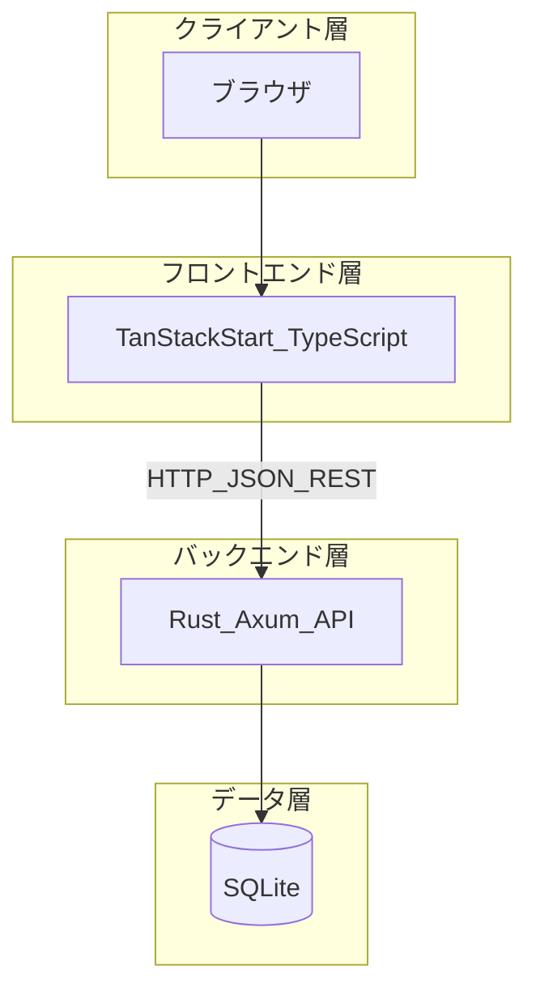
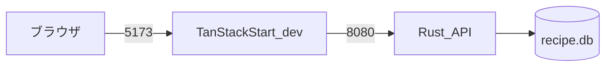
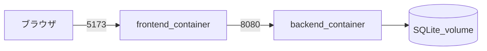
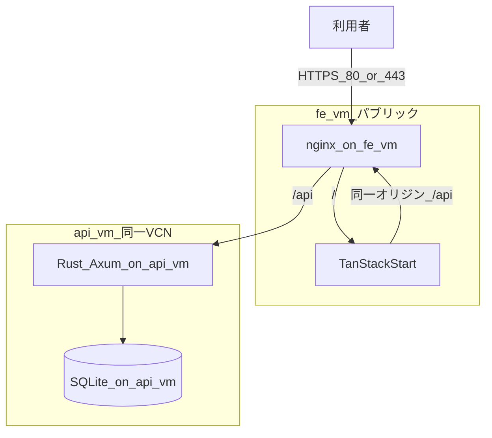
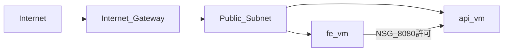
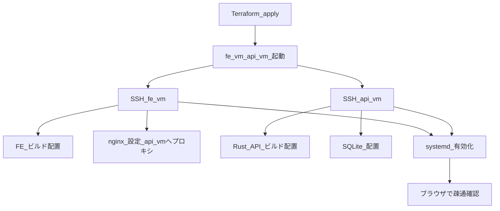

# システム構成

## 1. 3 層アーキテクチャ



| 層 | 技術 | 責務 |
| --- | --- | --- |
| フロントエンド | TanStack Start / TypeScript | UI、ルーティング、クライアント側バリデーション、API 呼び出し |
| バックエンド | Rust / Axum | REST API、サーバー側バリデーション、トランザクション、CORS |
| データベース | SQLite | 永続化 |

フロントエンドから SQLite へは直接接続しない。

## 2. ローカル開発構成



| コンポーネント | ポート / パス | 備考 |
| --- | --- | --- |
| フロントエンド | `http://localhost:5173` | Vite dev server |
| バックエンド | `http://localhost:8080` | Axum |
| SQLite | `./data/recipe.db`（例） | リポジトリ配下または backend 配下 |

開発時はオリジンが異なるため、API が CORS で `http://localhost:5173` を許可する。

### 2.1 Docker Compose（開発のみ・任意）

ローカル開発では **Docker Compose で FE / API / SQLite をまとめて起動してよい**。本番（OCI）では Docker は必須としない。

| 環境 | Docker |
| --- | --- |
| ローカル開発 | 任意（推奨可）。`docker compose up` で 5173 / 8080 を揃えられる |
| 本番（OCI） | 使わない。VM へビルド成果物を配置し、nginx + systemd で常駐させる |

**開発で Docker を使う理由**

- Rust / Node のバージョン差を吸収できる
- FE・API の 2 プロセス構成をそのまま再現できる
- 新規参加者が `git clone` → `docker compose up` で揃えやすい

**本番で Docker を必須にしない理由**

- fe-vm / api-vm が各 3 GB と小さく、Docker デーミンの分もメモリを消費する
- Ampere A1（ARM）向けイメージのビルド（`linux/arm64`）が増える
- 初級の IaaS 学習対象（nginx 設定、systemd、SSH デプロイ）がコンテナの裏に隠れやすい

**想定する compose 構成（実装時）**

```
docker-compose.yml
├── frontend   # TanStack Start, :5173
├── backend    # Rust/Axum, :8080
└── volumes    # recipe.db を backend にマウント（./data 等）
```



**起動イメージ**

```bash
docker compose up --build
```

Docker を使わない場合は、FE / API をそれぞれホスト上で起動する（§2 の表どおり）。

## 3. 本番構成（OCI IaaS）

PaaS では VCN、セキュリティリスト、SSH、リバースプロキシ、プロセス管理が見えにくい。学習目的で Compute インスタンス上に自己ホストする。

**フロントとバックは VM を分ける。** 1 台に nginx / FE / API / SQLite を全部載せる構成は採用しない。

### 3.1 OCI Always Free のリソース配分方針

**Ampere A1 の OCPU / メモリはテナンシー全体で合計上限** がある（2026 年時点の Always Free 目安: **合計 2 OCPU / 12 GB**）。この枠を複数 VM に分割できるが、**初級・中級・上級を同時に常時公開する前提にはしない**。

#### 初級（本アプリ）の最小配分

FE / API を VM で分ける学習目的は維持しつつ、**Always Free 内で済む最小構成** とする。

| VM | 役割 | 配分（最小） |
| --- | --- | --- |
| fe-vm | nginx + TanStack Start | 1 OCPU / 3 GB |
| api-vm | Rust API + SQLite | 1 OCPU / 3 GB |
| **合計** | | **2 OCPU / 6 GB** |

残り 6 GB は中級・上級用の余力、または同一 VM のスワップ・ビルド時の余裕として確保する。初級単体の常時運用には十分である。

x86 の Always Free マイクロ实例（最大 2 台、各 1 GB 程度）は ARM 枠と **別カウント** だが、Node 常駐にはメモリが厳しいため、初級 FE には使わない。

#### 中級・上級との共存方針

| 方針 | 内容 |
| --- | --- |
| 同時常時 3 環境 | **想定しない**。2 OCPU / 12 GB では 3 系統の本番を並行稼働させるのは現実的でない |
| ライフサイクル運用 | 受講が進んだタイミングで **前段階の環境を公開停止し、Terraform で削除** する |
| 初級 → 中級 | 中級の本番が必要になった時点で、初級の fe-vm / api-vm を `terraform destroy` し、枠を解放してから中級を構築する |
| 中級 → 上級 | 上級も同様。前課題の Compute を止めてから次を立ち上げる |

「3 つ同時公開が難しい場合は、中級完了（＝中級へ移行）時に初級を公開停止・削除する」方針で問題ない。課題提出用の URL は **常に 1 系統だけ** を本番として維持する。

#### データの扱い（環境削除時）

初級 VM 削除前に、必要なら `recipe.db` と Terraform state を手元へ退避する。公開停止後に DB ごと消えても、初級の提出要件を満たしていればよい。

#### Terraform での切り替えイメージ

```
初級: infra/terraform/environments/beginner/   → apply
中級: infra/terraform/environments/intermediate/ → beginner destroy 後に apply
上級: infra/terraform/environments/advanced/   → intermediate destroy 後に apply
```

環境ごとに Compartment または名前 prefix（`beginner-`, `intermediate-`）を分け、**どれが稼働中か迷わない** ようにする。

### 3.2 2 VM 構成図



| VM | 載せるもの | 公開 |
| --- | --- | --- |
| fe-vm | nginx、TanStack Start（本番 Node プロセス） | 80 / 443 をインターネット向けに開放 |
| api-vm | Rust API、SQLite ファイル | **8080 は fe-vm からのみ** NSG で許可。インターネットへ直接公開しない |

ブラウザは fe-vm の `/api` にだけアクセスし、nginx が api-vm へプロキシする。CORS は同一オリジンになり、本番ではシンプルになる。

### 3.3 ネットワーク（概念）



| 通信 | 方針 |
| --- | --- |
| fe-vm: 80 / 443 | 利用者向けに開放 |
| fe-vm / api-vm: 22 | 管理者 IP のみ |
| api-vm: 8080 | fe-vm のプライベート IP からのみ許可 |
| api-vm: 8080 | 0.0.0.0/0 には開けない |

同一 VCN 内のパブリックサブネットに 2 台置き、**VM 間通信は NSG で絞る** 構成とする（初級でも「層を VM で分ける」学習ができる）。

### 3.4 1 VM に全部載せない理由

| 観点 | 2 VM |
| --- | --- |
| 責務の分離 | FE と API を OS プロセスだけでなくホストでも分けられる |
| セキュリティ | DB 付き API をインターネットに直接晒さない |
| 学習 | 複数 Compute、NSG、VM 間プロキシを体験できる |
| Always Free | 初級は 2 OCPU / 6 GB の最小配分。中級・上級は前段階削除後に同枠を再利用 |

単一 VM は運用は楽だが、今回の「IaaS で層を分ける」意図には 2 VM の方が合う。

## 4. OCI を選ぶ理由

| 観点 | 内容 |
| --- | --- |
| 学習目的 | IaaS 上でネットワーク・VM・SSH・プロセス管理を体験する |
| コスト | AWS 無料枠は過去受講で使い切り済み。OCI Always Free は期限なしの Compute 枠がある |
| 命名 | インフラが OCI であることと、RDBMS が SQLite であることは別問題。Oracle Database は使わない |

## 5. Terraform（IaC）

公式プロバイダ [hashicorp/oci](https://registry.terraform.io/providers/hashicorp/oci/latest/docs) により、コンソール手作業をコード化する。

### 管理対象（第 1 段階）

| リソース | 目的 |
| --- | --- |
| Compartment | リソースをまとめる |
| VCN | 仮想ネットワーク |
| Internet Gateway | 外向き通信 |
| Route Table | 0.0.0.0/0 → IGW |
| Subnet | パブリックサブネット |
| Compute Instance（fe-vm） | フロント + nginx |
| Compute Instance（api-vm） | API + SQLite |
| Network Security Group | 80/443（fe）、8080（fe→api のみ）、22 の制御 |
| 公開 IP（任意） | 固定 IP が必要な場合 |

### 管理外（第 1 段階）

| 項目 | 理由 |
| --- | --- |
| nginx 設定ファイルの中身 | VM 内の構成管理（cloud-init や Ansible は将来検討） |
| アプリのビルド成果物 | SSH デプロイまたは CI を別途検討 |
| SQLite データ | ランタイムデータ。Terraform 対象外 |

### ディレクトリ構成（予定）

```
infra/
  terraform/
    modules/          # VCN, compute 等の共通モジュール
    environments/
      beginner/       # 初級（本アプリ）
      intermediate/   # 中級（将来）
      advanced/       # 上級（将来）
```

同一テナンシーで **常時 1 環境だけ apply** する。切り替え時は前環境を `terraform destroy` してから次を apply する。

`terraform.tfvars` には tenancy OCID 等を置き、**リポジトリにはコミットしない**。

### 実行イメージ

```bash
cd infra/terraform/environments/beginner
terraform init
terraform plan
terraform apply
```

中級へ移行するとき:

```bash
cd infra/terraform/environments/beginner
terraform destroy          # 初級を公開停止・削除

cd ../intermediate
terraform apply            # 中級を構築
```

Always Free の範囲を超えるシェイプや有料リソースは plan 段階で確認する。

## 6. デプロイフロー（概要）



## 7. バックアップ

| 対象 | 方法 |
| --- | --- |
| SQLite | api-vm 上の `recipe.db` を定期的にコピー（別ストレージや手元へ） |
| Terraform 状態 | リモート state または手元で安全に保管。シークレットは含めない |

## 8. 監視・ログ（最低限）

- API: リクエスト method / path / status を標準出力
- nginx: アクセスログ
- 障害時: systemd の `journalctl` でプロセス状態を確認

本番監視 SaaS は必須としない。

## 9. 将来拡張

| 項目 | 方向性 |
| --- | --- |
| HTTPS 本番化 | Let's Encrypt + nginx |
| DB | PostgreSQL を別 VM またはマネージドへ |
| CI/CD | GitHub Actions で build & deploy |
| 認証 | バックエンドにセッション or JWT、フロントにログイン画面 |
