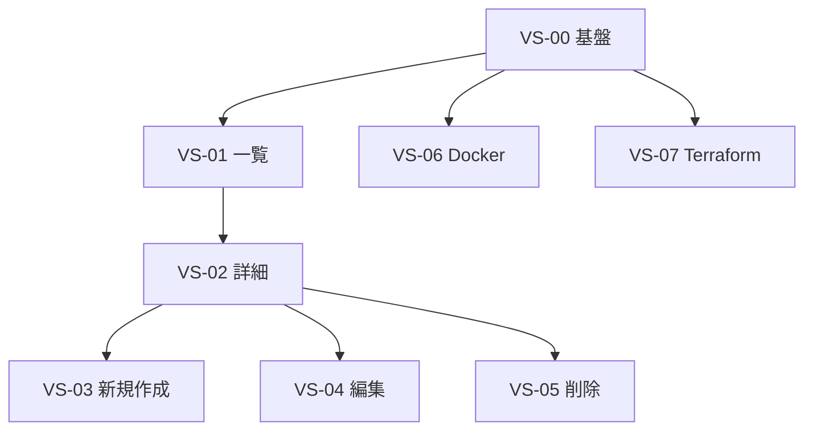

# 開発ガイド

## 1. 開発方針

本プロジェクトの実装は **TDD（テスト駆動開発）** と **垂直スライス** で進める。

### 1.1 TDD サイクル

1. **RED**: スライス内の要件を満たす **失敗するテスト** を先に書く
2. **GREEN**: テストが通る **最小限の実装** を行う
3. **REFACTOR**: 重複を除き、可読性を保つ（テストは Green のまま）

### 1.2 垂直スライス

Issue は **層ごと（API 全部 → 画面全部）ではなく、ユースケース単位** で切る。1 Issue 内で **バックエンド API + フロント画面 + テスト** をセットで完結させ、動く機能を少しずつ積み上げる。

| 方式 | 例 | 本プロジェクト |
| --- | --- | --- |
| 水平（採用しない） | 「一覧 API 全部」→「一覧画面」 | ✗ |
| **垂直（採用）** | 「一覧・検索・フィルタ」= API + SC-01 + テスト | ✓ |

各 Issue 完了時点で **ブラウザからその機能が End-to-End で動く** 状態を目指す。

## 2. リポジトリ構成（予定）

```
recipe-app/
├── frontend/          # TanStack Start + Tailwind + shadcn/ui + Lucide
├── backend/           # Rust / Axum
├── data/              # SQLite ファイル（gitignore）
├── infra/             # Terraform（OCI）
├── docs/
├── prototypes/
└── docker-compose.yml # 開発用（任意）
```

## 3. テスト戦略

垂直スライスごとに **BE 結合テスト + FE 単体/コンポーネントテスト** を同じ Issue で RED → GREEN する。

### 3.1 バックエンド（Rust / Axum）

| 種別 | ツール | 対象 |
| --- | --- | --- |
| 単体テスト | `cargo test` | バリデーション、ドメインロジック |
| 結合テスト | `axum` + テスト用 SQLite | 当該スライスの REST エンドポイント |
| DB | インメモリ or 一時ファイル SQLite | マイグレーション、シード、トランザクション |

### 3.2 フロントエンド（TanStack Start）

| 種別 | ツール | 対象 |
| --- | --- | --- |
| 単体 | Vitest | 按分計算、DifficultyRating、バリデーション |
| コンポーネント | Vitest + Testing Library | 当該画面、Dialog、空状態 |
| 結合（任意） | Playwright 等 | スライス単位 E2E |

### 3.3 垂直スライスでの RED 例（VS-01 一覧）

**バックエンド**

```rust
#[tokio::test]
async fn get_recipes_filters_by_category_id() {
    let app = test_app().await;
    let res = app.get("/api/recipes?category_id=1").await;
    assert_eq!(res.status(), 200);
}
```

**フロントエンド**

```typescript
it('DifficultyRating renders 3 filled Star icons', () => {
  render(<DifficultyRating value={3} />)
  expect(screen.getAllByRole('img', { hidden: true })).toHaveLength(5)
  // filled vs outline は実装に合わせて assert
})
```

同一 Issue 内で BE → FE の順、またはテスト先行で両方 RED にしてから GREEN する。

### 3.4 テストデータ

- カテゴリは [データモデル](05-data-model.md) のシード 5 件を利用
- 結合テスト用レシピは各テストで INSERT するか、フィクスチャ関数で生成

## 4. 垂直スライス Issue 一覧

Epic: [#29 垂直スライス実装ロードマップ](https://github.com/rikuto-web/recipe-app/issues/29)（旧 #2–#20 は superseded）

| スライス | Issue | 内容 |
| --- | --- | --- |
| VS-00 | [#21](https://github.com/rikuto-web/recipe-app/issues/21) | 基盤（Walking Skeleton） |
| VS-01 | [#22](https://github.com/rikuto-web/recipe-app/issues/22) | 一覧・検索・フィルタ |
| VS-02 | [#23](https://github.com/rikuto-web/recipe-app/issues/23) | 詳細・人数按分 |
| VS-03 | [#24](https://github.com/rikuto-web/recipe-app/issues/24) | 新規作成 |
| VS-04 | [#25](https://github.com/rikuto-web/recipe-app/issues/25) | 編集 |
| VS-05 | [#27](https://github.com/rikuto-web/recipe-app/issues/27) | 削除 |
| VS-06 | [#26](https://github.com/rikuto-web/recipe-app/issues/26) | Docker Compose |
| VS-07 | [#28](https://github.com/rikuto-web/recipe-app/issues/28) | Terraform 初級 |



### 各スライスの範囲（概要）

| スライス | バックエンド | フロントエンド |
| --- | --- | --- |
| VS-00 | マイグレーション、シード、health、CORS/エラー/ログ | TanStack Start、Tailwind、shadcn/ui、Lucide、`DifficultyRating`、AppShell |
| VS-01 | `GET /api/categories`, `GET /api/recipes` | SC-01、search params 同期 |
| VS-02 | `GET /api/recipes/{id}` | SC-02、按分、`DifficultyRating` |
| VS-03 | `POST /api/recipes` | SC-03 |
| VS-04 | `PUT`, 材料/手順行 API | SC-04 |
| VS-05 | `DELETE /api/recipes/{id}` | 一覧・詳細の削除 UI + Dialog |
| VS-06 | — | docker-compose.yml |
| VS-07 | — | Terraform beginner |

## 5. ローカル開発

| 方式 | コマンド（実装後） |
| --- | --- |
| 個別起動 | FE: `pnpm dev`（:5173）、BE: `cargo run`（:8080） |
| Docker Compose | `docker compose up --build` |

詳細は [システム構成 §2](07-architecture.md#2-ローカル開発構成) を参照。

## 6. コーディング規約（最低限）

- API の入出力は [API 設計](06-api.md) に準拠
- エラーレスポンス形式を共通化（`error.code`, `error.message`, `error.details`）
- フロントのルートパスは [画面遷移](04-screen-transitions.md) に準拠
- UI は [UI デザイン](08-ui-design.md)（Pattern A + Lucide アイコン）に準拠

## 7. Issue とドキュメントの対応

| Issue 領域 | 参照ドキュメント |
| --- | --- |
| API | [06-api.md](06-api.md), [05-data-model.md](05-data-model.md) |
| 画面 | [04-screen-transitions.md](04-screen-transitions.md), [08-ui-design.md](08-ui-design.md) |
| ユースケース | [03-use-cases.md](03-use-cases.md) |
| 非機能 | [02-non-functional-requirements.md](02-non-functional-requirements.md) |
| インフラ | [07-architecture.md](07-architecture.md) |
